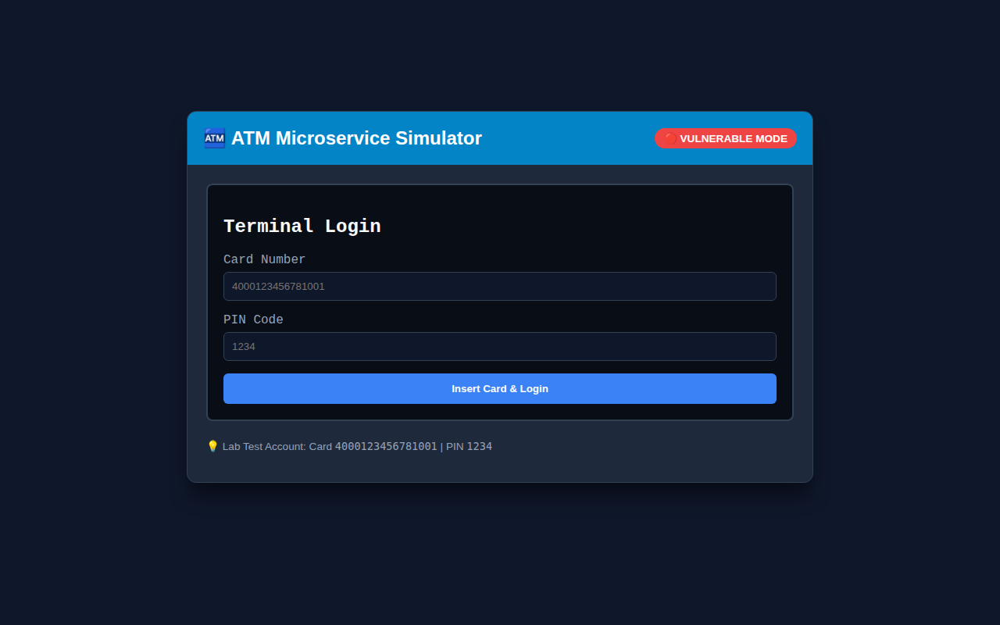
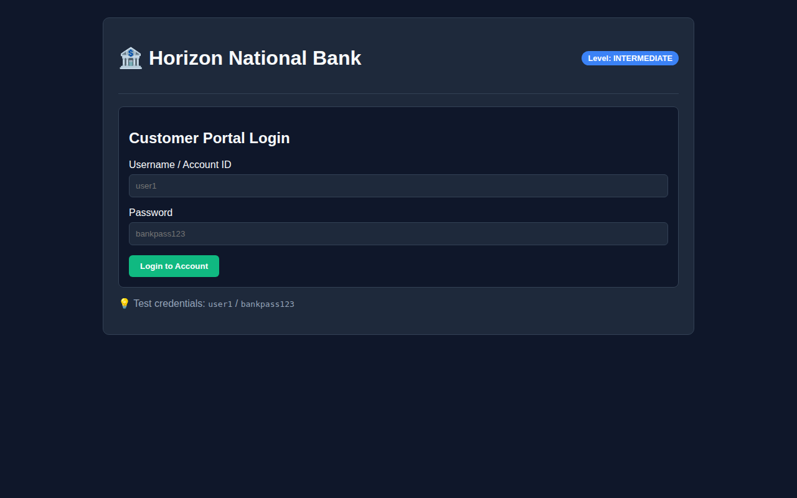
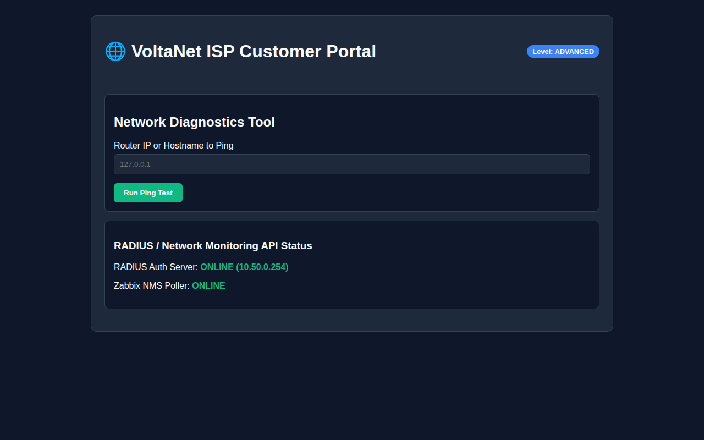
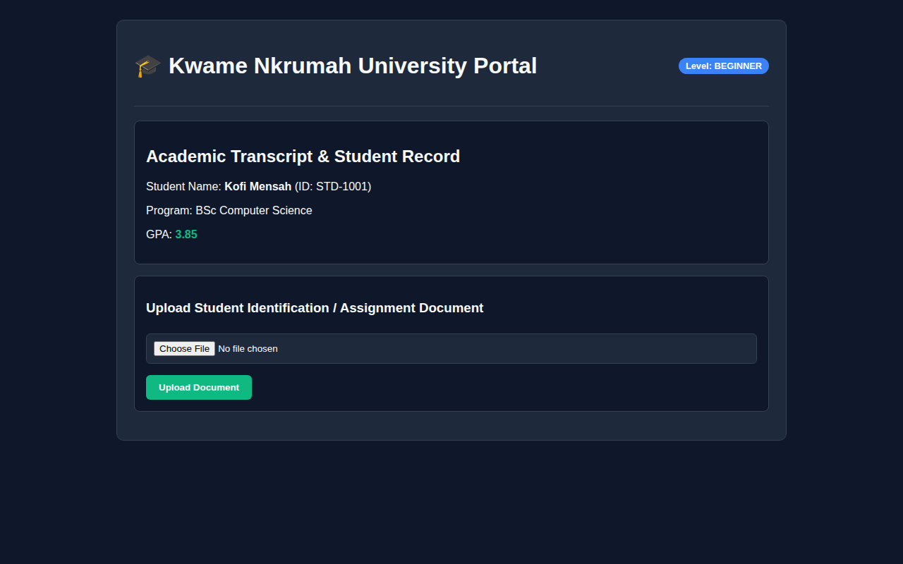
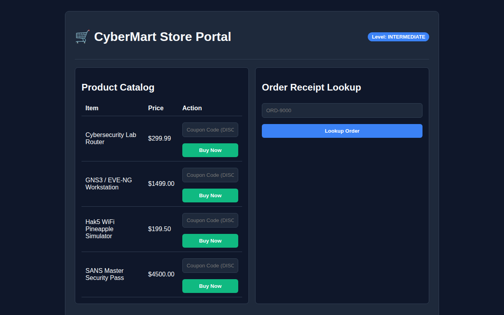

# 📖 Cyber Range Platform - Complete User & Administration Guide

Welcome to the **Cyber Range Microservices Platform**. This comprehensive guide explains how to start, configure, manage, and use the platform for cybersecurity testing, red/blue team exercises, and general networking simulation.

---

## 📸 Platform Interface Visual Overview

### 1. Central Manager Control Plane (Port 9000)
The Central Manager Dashboard provides a unified control panel for all microservices, port allocations, environment purpose toggles, update checks, and Mini DNS configuration.


---

### 2. Microservice Targets Overview

| Service | Port | Local URL | Screenshots | Primary Vulnerabilities |
| :--- | :--- | :--- | :--- | :--- |
| **🏧 ATM Simulator** | `8080` | `http://atm.lab:8080` |  | IDOR / BOLA, Negative Balance Withdrawal Flaw |
| **🏦 Online Banking** | `8081` | `http://bank.lab:8081` |  | SQL Injection (SQLi), Reflected XSS |
| **🌐 ISP Portal** | `8082` | `http://isp.lab:8082` |  | Command Injection in Ping Tool, RADIUS API |
| **🎓 Student Portal** | `8083` | `http://school.lab:8083` |  | Arbitrary File Upload, Student Transcript IDOR |
| **🛒 E-Commerce Store** | `8084` | `http://shop.lab:8084` |  | Client Price Tampering, Coupon Reuse Flaw |

---

## 🚀 Step-by-Step Quickstart Instructions

### Step 1: Starting the Microservices & Manager
Run the platform launcher script directly on your Ubuntu VM host:

```bash
chmod +x start_labs.sh
./start_labs.sh
```

All services will start automatically on distinct individual ports:
- **Manager Control Plane**: `http://<YOUR_HOST_IP>:9000`
- **ATM Simulator**: `http://<YOUR_HOST_IP>:8080`
- **Online Banking**: `http://<YOUR_HOST_IP>:8081`
- **ISP Portal**: `http://<YOUR_HOST_IP>:8082`
- **Student Portal**: `http://<YOUR_HOST_IP>:8083`
- **E-Commerce Store**: `http://<YOUR_HOST_IP>:8084`

---

### Step 2: Configuring Individual Port Allocations
You can customize the listening port for any microservice:

1. Open the Manager Dashboard at `http://<YOUR_HOST_IP>:9000`.
2. Locate the microservice card you wish to configure (e.g., *Online Banking Portal Lab*).
3. Update the **Individual Port Allocation** input field (e.g. change `8081` to `8888`).
4. Click **Save & Apply**.
5. The application will immediately synchronize the new port setting across the control plane!

---

### Step 3: Setting Up UDP Mini DNS Resolver (`mini_dns.py`)
To allow virtual routers in GNS3, EVE-NG, or client attack machines to resolve `.lab` domain names (`atm.lab`, `bank.lab`, `isp.lab`, `school.lab`, `shop.lab`):

1. On the Manager Dashboard, navigate to the **Mini DNS Resolver Server Settings** panel.
2. Toggle **Enable UDP Mini DNS Server** to `🟢 Enabled`.
3. Set the **Target Host IP Address** to your Ubuntu VM host IP (e.g. `192.168.1.100` or `10.50.0.10`).
4. Set the **DNS UDP Port** (default: `5353`).
5. Click **Save & Apply DNS Settings**.
6. On your attack machine or GNS3 virtual router, set your DNS server address to `<UBUNTU_VM_IP>:5353`.

---

### Step 4: Dual Environment Purpose Modes

Administrators can switch microservices between two modes:

#### 1. ⚔️ Cybersecurity Lab Target Mode
- Full vulnerability scenarios, login forms, API authorization flaws, and CTF flags are active for penetration testing.

#### 2. 🌐 General Networking Test Node Mode
- Microservices remain 100% reachable via HTTP GET and `ping` for testing routing, firewalls, and subnets inside GNS3 / EVE-NG.
- State-modifying POST requests and authentication endpoints return `HTTP 503 Service Unavailable (Network Test Node)`.

---

### Step 5: Checking for Platform Updates
To verify if your cyber range platform is synchronized with the latest release:

1. Click the **🔄 Check for Updates** button in the top right header of the Manager Dashboard (`http://<YOUR_HOST_IP>:9000`).
2. The dashboard will query `/api/v1/system/check-update` and display live status confirmation.
